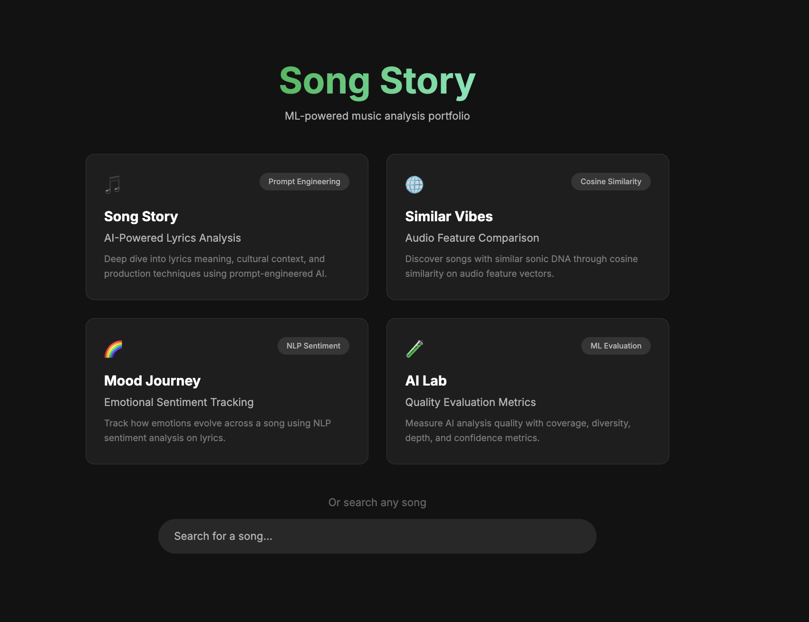
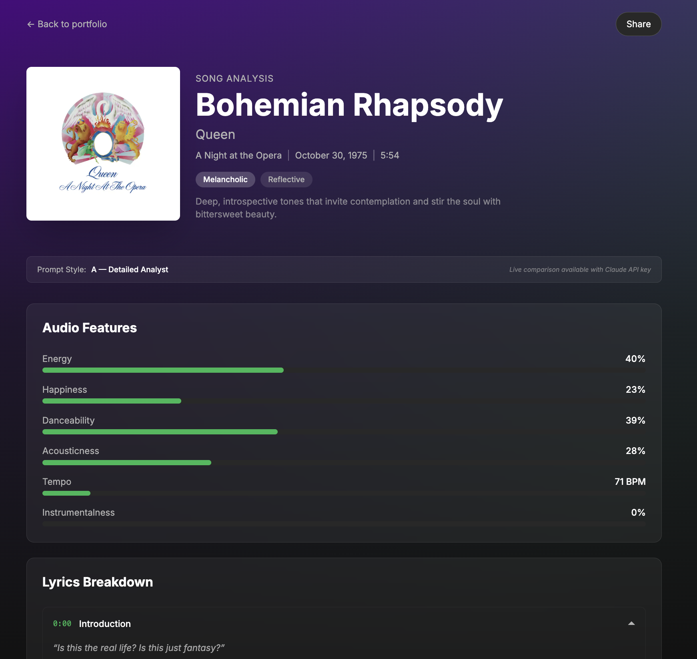
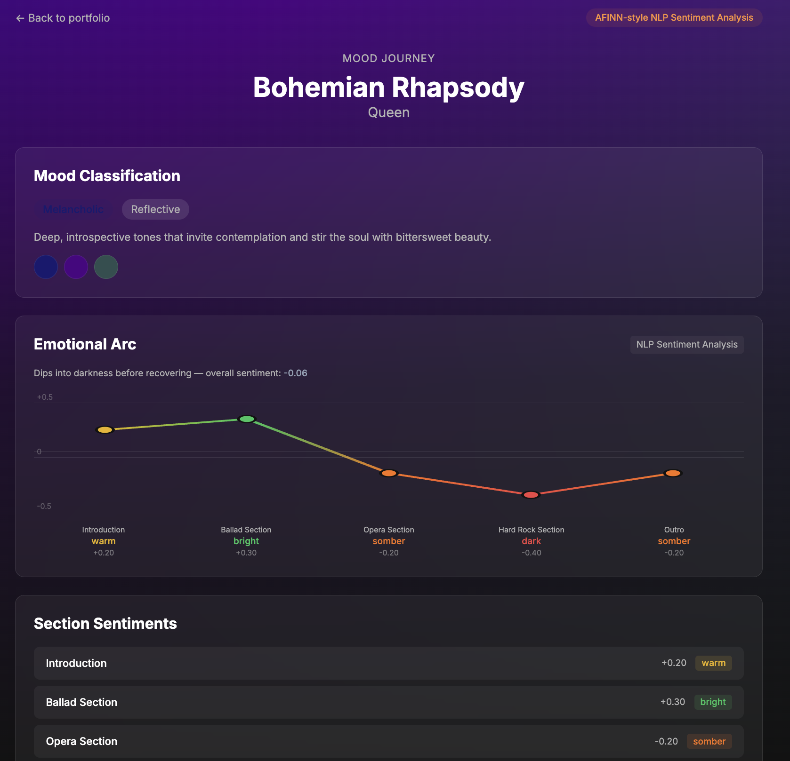
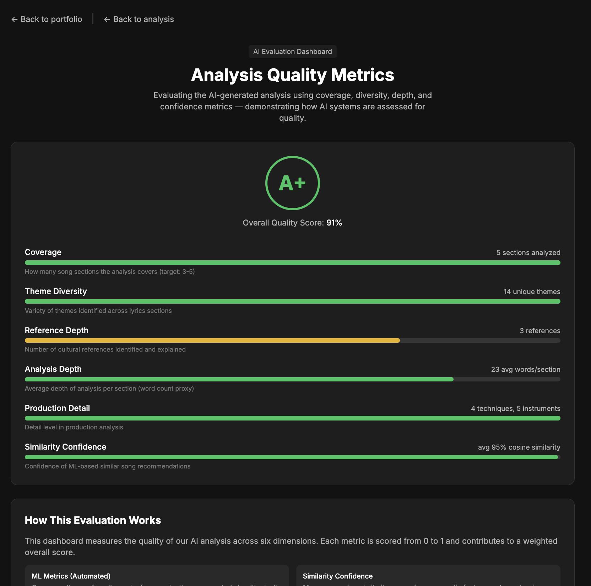

# Song Story - ML-Powered Music Analysis Portfolio

An ML-powered music analysis portfolio built in **2 hours** with **[Claude Code](https://claude.ai)**. Four distinct mini-apps showcase different ML/AI techniques applied to music analysis — from prompt engineering to cosine similarity to NLP sentiment analysis to evaluation metrics.

> Built entirely through AI pair programming with Claude Code. Every backend service, frontend page, and ML pipeline was designed and implemented collaboratively in a single session.


## Screenshots

### Portfolio Homepage


### Song Story — AI-Powered Lyrics Analysis


### Mood Journey — Emotional Sentiment Tracking


### AI Lab — Evaluation Metrics Dashboard


## The Four Corners

| App | Route | ML Technique | What It Does |
|-----|-------|-------------|-------------|
| **Song Story** | `/song/[id]` | Prompt Engineering + A/B Testing | Deep lyrics analysis, cultural context, and production breakdown |
| **Similar Vibes** | `/discover/[id]` | Cosine Similarity | Find songs with similar audio DNA via feature vector comparison |
| **Mood Journey** | `/mood/[id]` | NLP Sentiment Analysis | Track emotional arc across song sections using AFINN-style scoring |
| **AI Lab** | `/evaluate/[id]` | ML Evaluation Metrics | Measure AI output quality with coverage, diversity, depth, and confidence |

## Architecture

```
┌─────────────────────────────────────────────────────────────┐
│                    Frontend (Next.js 14)                     │
│                                                             │
│  ┌──────────┐ ┌──────────┐ ┌──────────┐ ┌───────────────┐  │
│  │ /        │ │ /song/   │ │ /mood/   │ │ /discover/    │  │
│  │ Portfolio │ │ [id]     │ │ [id]     │ │ [id]          │  │
│  │ 2x2 Grid │ │ Lyrics   │ │ Emotion  │ │ Similar Songs │  │
│  └────┬─────┘ └────┬─────┘ └────┬─────┘ └──────┬────────┘  │
│       │            │            │               │           │
│  ┌────┴────┐  ┌────┴─────────────┴──┐    ┌──────┴────────┐  │
│  │/evaluate│  │ /api/analyze (POST) │    │/api/similar/  │  │
│  │ /[id]   │  │                     │    │ {song_id}     │  │
│  └────┬────┘  └─────────┬───────────┘    └──────┬────────┘  │
│       │                 │                       │           │
└───────┼─────────────────┼───────────────────────┼───────────┘
        │                 │                       │
┌───────┼─────────────────┼───────────────────────┼───────────┐
│       ▼                 ▼         Backend (FastAPI)         │
│  ┌─────────┐    ┌──────────────┐    ┌──────────────────┐    │
│  │  Eval   │    │  LLM Service │    │   Similarity     │    │
│  │ Service │    │  (Prompt Eng)│    │   Service        │    │
│  │         │    │              │    │  (Cosine Sim)    │    │
│  │ 6 metrics│   │ A/B variants │    │  Audio Features  │    │
│  └────┬────┘    └──────┬───────┘    └────────┬─────────┘    │
│       │                │                     │              │
│       │         ┌──────┴───────┐      ┌──────┴─────────┐    │
│       │         │  Sentiment   │      │  Song Service   │    │
│       │         │  Service     │      │  (Mock Data)    │    │
│       │         │  (AFINN NLP) │      │                 │    │
│       └─────────┴──────────────┘      └────────────────┘    │
│                                                             │
└─────────────────────────────────────────────────────────────┘
```

## AI/ML Techniques

| Technique | Implementation | File |
|---|---|---|
| **Cosine Similarity** | Audio feature vectors compared using pure-math cosine similarity to find genuinely similar songs — no sklearn, just the algorithm | `backend/services/similarity_service.py` |
| **Sentiment Analysis** | AFINN-style keyword-based scorer with ~200 weighted words, computing emotional arc across song sections (-1 dark to +1 bright) | `backend/services/sentiment_service.py` |
| **Prompt Engineering** | Two distinct prompt strategies (A: detailed analyst, B: concise critic) with A/B comparison for LLM output quality | `backend/prompts/analysis_prompt.py` |
| **LLM Evaluation** | Automated quality metrics dashboard measuring coverage, theme diversity, reference depth, analysis depth, and similarity confidence | `backend/services/eval_service.py` |
| **Structured Output Parsing** | Pydantic model validation on Claude JSON output with graceful fallback to mock data | `backend/services/llm_service.py` |
| **Feature Engineering** | Normalized audio feature vectors (energy, valence, tempo, danceability, acousticness, instrumentalness) for ML pipeline input | `backend/services/similarity_service.py` |

## Features

- **Portfolio Homepage** — 2x2 grid showcasing all four ML experiences with hover previews
- **Lyrics Breakdown** — Section-by-section analysis with themes and timestamps
- **Emotional Arc** — NLP sentiment analysis charting mood progression through the song
- **Mood Detection** — Derives emotional mood from audio features with adaptive gradient backgrounds
- **Cultural Context** — Historical background, cultural references, and impact analysis
- **Production Analysis** — Techniques, instruments, and notable production elements
- **ML-Powered Similar Songs** — Cosine similarity on audio feature vectors with side-by-side comparison bars
- **AI Evaluation Dashboard** — Quality metrics scoring the AI analysis output across 6 dimensions
- **Prompt A/B Testing** — Compare two prompt strategies side-by-side (with live Claude API)
- **Generative Mood Artwork** — CSS-based visual art generated from mood colors and song themes
- **Search** — Debounced autocomplete with keyboard navigation
- **Claude AI Integration** — Live analysis via Anthropic API with smart mock-data fallback

## Quick Start

### Prerequisites

- Python 3.11+
- Node.js 18+

### Backend

```bash
cd backend
python3 -m venv .venv && source .venv/bin/activate
pip install -r requirements.txt

# Optional: enable live Claude analysis + prompt A/B testing
cp .env.example .env
# Edit .env and add your Anthropic API key

python3 -m uvicorn main:app --reload --port 8000
```

### Frontend

```bash
cd frontend
npm install
npm run dev
```

Open [http://localhost:3000](http://localhost:3000).

All features work out of the box with mock data. Add a `ANTHROPIC_API_KEY` to `.env` for live Claude-powered analysis.

## How It Works

1. User visits the portfolio homepage and picks one of the four ML experiences
2. Backend looks up the song in the catalog and extracts audio features
3. **Mood Service** classifies the song into mood quadrants (Euphoric / Intense / Peaceful / Melancholic) based on energy + valence
4. **LLM Service** sends song data to Claude for deep analysis — supports A/B prompt variants, falls back to mock data if no API key
5. **Similarity Service** computes cosine similarity on audio feature vectors to find the most similar songs, with full audio features for comparison
6. **Sentiment Service** scores each lyrics section from -1 to +1, detecting the emotional arc shape (ascending, descending, peak, valley, steady)
7. **Image Service** generates a mood-based artwork prompt and CSS visualization
8. Frontend renders everything with staggered animations and adaptive mood gradient backgrounds
9. **Evaluation Dashboard** computes quality metrics on the AI output across 6 dimensions

## Project Structure

```
backend/
├── main.py                    # FastAPI app, CORS, router registration
├── models/schemas.py          # Pydantic request/response models
├── routers/
│   ├── analyze.py             # POST /api/analyze
│   ├── evaluate.py            # GET  /api/evaluate/{song_id}
│   ├── similar.py             # GET  /api/similar/{song_id}
│   ├── search.py              # GET  /api/search?q=...
│   └── feedback.py            # POST /api/feedback
├── services/
│   ├── song_service.py        # Song catalog search & lookup
│   ├── llm_service.py         # Claude API + A/B prompt variants
│   ├── similarity_service.py  # Cosine similarity on audio features
│   ├── sentiment_service.py   # NLP sentiment scoring & emotional arc
│   ├── eval_service.py        # AI output quality evaluation metrics
│   ├── mood_service.py        # Audio features → mood classification
│   └── image_service.py       # Mood-based artwork generation
├── prompts/                   # LLM prompt templates (A/B variants)
└── data/                      # Mock songs & analysis data

frontend/
├── app/
│   ├── page.tsx               # Portfolio homepage (2x2 grid)
│   ├── song/[id]/page.tsx     # Song Story — lyrics analysis
│   ├── discover/[id]/page.tsx # Similar Vibes — cosine similarity
│   ├── mood/[id]/page.tsx     # Mood Journey — sentiment analysis
│   └── evaluate/[id]/page.tsx # AI Lab — evaluation metrics
├── components/
│   ├── PortfolioCard.tsx      # Homepage card with hover preview
│   ├── BackToPortfolio.tsx    # Navigation back to homepage
│   ├── EmotionalArc.tsx       # Sentiment line chart visualization
│   ├── EvalMetrics.tsx        # Evaluation quality metrics bars
│   ├── SongSearch.tsx         # Debounced search with keyboard nav
│   ├── SongHeader.tsx         # Album art, title, mood badges
│   ├── AudioFeatures.tsx      # Animated feature bars
│   ├── LyricsBreakdown.tsx    # Accordion with feedback per section
│   ├── MoodGradient.tsx       # Adaptive background gradients
│   └── ui/                    # Reusable primitives (Card, Badge, etc.)
└── lib/
    ├── api.ts                 # API client functions
    ├── types.ts               # TypeScript interfaces
    ├── colors.ts              # Mood gradient utilities
    └── utils.ts               # Formatting helpers
```

## Tech Stack

| Layer | Technology |
|-------|-----------|
| Backend | FastAPI, Pydantic, Anthropic SDK |
| Frontend | Next.js 14, TypeScript, Tailwind CSS, Framer Motion |
| AI/ML | Claude for analysis, cosine similarity for recommendations, keyword sentiment for emotional arc |
| Evaluation | Automated quality metrics across 6 dimensions |
| Styling | Spotify-inspired dark theme, glassmorphism, animated gradients |

## Built With Claude Code

This entire project was built in a **2-hour session** using [Claude Code](https://claude.ai) as an AI pair programmer. Claude handled full-stack architecture design, backend API implementation, ML pipeline implementation, frontend development, component design with animations, and testing — demonstrating what's possible when you combine AI pair programming with clear architectural thinking.
